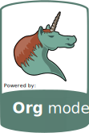

# Monero Terimleri Turkce Sozlugu

## Genel yaklasim

1. Her seyden once estetik.  Monero teriminin turkce karsiliklari
   agzinizdan ciktiktan sonra sizi utandirmamali, "su anda amma da
   garip bir laf ettik," dedirtmemeli.
   
2. Birinci kural belirli bir esneklige sahip.  Gercekten Turkce'de yer
   etmesinde direttiginiz kelimeler, kullanildikca ilk defa
   duyulduklarindaki garipliklerini yitirebilirler.  "Tohum kelime"
   ornegi bunlardan birisi.

## Monero Terimleri
```
                            ━━━━━━━━━━━━━━━
                             MONERO SOZLUK
                            ━━━━━━━━━━━━━━━

+--------------+-----------------------+----------------------------------------------------------------------------------+
| en           | tr                    | kisa aciklama (varsa)                                                            |
+--------------+-----------------------+----------------------------------------------------------------------------------+
| coin         | koin                  |   "akce", veya "demir para" demek estetik durmuyor.  "Coin" olarak birakmak da   |
|              |                       |                         Turkce okuma kurallarina aykiri.                         |
|              |                       |                                                                                  |
|              |                       |                                                                                  |
+--------------+-----------------------+----------------------------------------------------------------------------------+
|cryptoanarchy |kriptoanarsi           |"kripto" burada "sakli", "gizli", "gomulu" anlam kokeninde.  Fakat "kripto" bu    |
|              |                       |baglamda coktan yaygin kullanimda.                                                |
+--------------+-----------------------+----------------------------------------------------------------------------------+
|cryptocurrency|kriptopara             |"kripto" burada "sakli", "gizli", "gomulu" anlam kokeninde.  Fakat "kripto" bu    |
|              |                       |baglamda coktan yaygin kullanimda.                                                |
+--------------+-----------------------+----------------------------------------------------------------------------------+
|cypherpunk    |sifrepunk              |"Cypher" kelimesi arapca "sifr", "sifre" kelimesinden turemistir.  Oze donus.     |
|              |                       |                                                                                  |
+--------------+-----------------------+----------------------------------------------------------------------------------+
|cyberpunk     |siberpunk              |Yuksek teknoloji, dusuk yasam kalitesi.                                           |
|              |                       |                                                                                  |
+--------------+-----------------------+----------------------------------------------------------------------------------+
|libertarian   |liberteryen            |Bireyselci Amerikan politik dusunce sistemi.                                      |
|              |                       |                                                                                  |
+--------------+-----------------------+----------------------------------------------------------------------------------+
|libertarianism|liberteryencilik       |Bireyselci Amerikan politik dusunce sistemi.                                      |
|              |                       |                                                                                  |
+--------------+-----------------------+----------------------------------------------------------------------------------+
|mine (verb)   |uretim                 |Baglama gore "uretim" kelimesi, "madencilik" demektense, agza daha iyi oturmakta. |
|              |                       |                                                                                  |
+--------------+-----------------------+----------------------------------------------------------------------------------+
|mining        |uretim,                |Baglama gore "uretim" kelimesi, "madencilik" demektense, agza daha iyi oturmakta. |
|              |madencilik             |                                                                                  |
+--------------+-----------------------+----------------------------------------------------------------------------------+
|peer to peer  |bireyden bireye        |Bir bilgisayardan diger bilgisayara dogrudan gerceklesen haberlesme.  Veya,       |
|              |                       |fiziksel dunyada iki bireyin, araci kuruma guvenmek zorunda kalmadan              |
|              |                       |gerceklestirdikleri haberlesme.                                                   |
+--------------+-----------------------+----------------------------------------------------------------------------------+
|proof of work |harcanan is            |Sadece "is kaniti" yetersiz.  Yapilan isin geri donulemez sekilde harcandigini da |
|              |kaniti                 |belirtmek iyi olur.                                                               |
+--------------+-----------------------+----------------------------------------------------------------------------------+
|network       |ag                     |Bilgisayarlarin birbirleriyle haberleserek olusturduklari haberlesme aglari.      |
|              |                       |                                                                                  |
+--------------+-----------------------+----------------------------------------------------------------------------------+
|node          |dugum                  |Bilgisayarlarin olusturduklari haberlesme aginda bulunan tekil bilgisayarlara     |
|              |                       |verilen isim.  Tipki bir balik aginda bulunan halatlarin dolanip bir araya        |
|              |                       |geldigi, yapiya iskelet kattigi kisim gibi.                                       |
+--------------+-----------------------+----------------------------------------------------------------------------------+
|decentralize  |merkeziyetsizlestirmek,|Herhangi bir haberlesme aginin, farkli cografik konumlarda bulunan farkli kisiler |
|(verb)        |dagitmak               |tarafindan calistirilan bilgisayarlarla olusturulmasi.                            |
|              |                       |                                                                                  |
+--------------+-----------------------+----------------------------------------------------------------------------------+
|tip           |bahsis                 |                                                                                  |
|              |                       |                                                                                  |
+--------------+-----------------------+----------------------------------------------------------------------------------+
|private       |gizli, ozel            |                                                                                  |
|              |                       |                                                                                  |
+--------------+-----------------------+----------------------------------------------------------------------------------+
|privacy       |gizlilik, mahremiyet   |Baglama gore "gizlilik koruyan" olarak da ifade edilebilir.  Ornegin, "privacy    |
|              |                       |coin", "gizlilik koruyan koin."                                                   |
+--------------+-----------------------+----------------------------------------------------------------------------------+
|donation      |bagis                  |                                                                                  |
|              |                       |                                                                                  |
+--------------+-----------------------+----------------------------------------------------------------------------------+
|app           |uygulama               |Kitlelerin "bilgisayar programi" deyis sekli.                                     |
|              |                       |                                                                                  |
+--------------+-----------------------+----------------------------------------------------------------------------------+
|wallet        |cuzdan                 |                                                                                  |
|              |                       |                                                                                  |
+--------------+-----------------------+----------------------------------------------------------------------------------+
|paper wallet  |kagit cuzdan           |Tohum kelimelerinin fiziksel bir kagit uzerinde yazili oldugu cuzdan bicimi.  Bu  |
|              |                       |cesit bir cuzdana ait adreslere odeme kabul edilebilir.  Bu cesit bir cuzdandan   |
|              |                       |disari para gonderebilmek icin, cuzdan uzerindeki tohum kelimelerin oncelikle bir |
|              |                       |cuzdan uygualamasi cierisne aktarilmasi gerekir.                                  |
+--------------+-----------------------+----------------------------------------------------------------------------------+
|block         |blok                   |                                                                                  |
|              |                       |                                                                                  |
+--------------+-----------------------+----------------------------------------------------------------------------------+
|block time    |blok zamani            |Blokzincirde birbiri ardinda gelen bloklar arasindaki zaman dilimi.               |
|              |                       |                                                                                  |
+--------------+-----------------------+----------------------------------------------------------------------------------+
|block height  |blok yuksekligi        |BLokzincire en son eklenmis blok adedi.                                           |
|              |                       |                                                                                  |
+--------------+-----------------------+----------------------------------------------------------------------------------+
|send          |yolla, gonder          |                                                                                  |
|              |                       |                                                                                  |
+--------------+-----------------------+----------------------------------------------------------------------------------+
|receive       |al                     |Receive, "Al".  Buy, "Satin Al".  Bu sekilde ikisi arasindaki fark belirtilir.    |
|              |                       |                                                                                  |
+--------------+-----------------------+----------------------------------------------------------------------------------+
|private key   |gizli anahtar          |Baskalarina asla verme.                                                           |
|              |                       |                                                                                  |
+--------------+-----------------------+----------------------------------------------------------------------------------+
|public key    |acik anahtar           |Baskalari ile paylasabilirsin.  Fakat paylastigin zaman, baskalarina hangi bilgiyi|
|              |                       |acik ettigini, once bil.                                                          |
+--------------+-----------------------+----------------------------------------------------------------------------------+
|blockchain    |blokzincir             |                                                                                  |
|              |                       |                                                                                  |
+--------------+-----------------------+----------------------------------------------------------------------------------+
|stealth       |hayalet adres          |Gercek adresin acik olarak gorulemedigi adares cesidi.  Monero'daki varsayilan    |
|address       |                       |ayarlarda butun cuzdanlarin kullandigi, olagan adres cesidi.                      |
+--------------+-----------------------+----------------------------------------------------------------------------------+
|ring signature|cember imza            |Birden fazla anahtarin bir araya gelip, gercek imzayi atan anahtarin acikca       |
|              |                       |secilemedigi kriptografik imza yontemi.                                           |
+--------------+-----------------------+----------------------------------------------------------------------------------+
|confidential  |gizli islem            |El degistiren miktarlarin sifrelenerek saklandigi parasal islem.                  |
|transaction   |                       |                                                                                  |
+--------------+-----------------------+----------------------------------------------------------------------------------+
|ring          |cember gizli islem     |Cember imza ve gizli islem yontemlerinin bir arada kullanildigi parasal islem.    |
|confidential  |                       |                                                                                  |
|transaction   |                       |                                                                                  |
+--------------+-----------------------+----------------------------------------------------------------------------------+
|merchant      |satici, tuccar         |                                                                                  |
|              |                       |                                                                                  |
+--------------+-----------------------+----------------------------------------------------------------------------------+
|consensus     |gorus birligi          |Bir konu, kural, yargi veya hareket sekli hakkinda ayni fikirde olmak.            |
|              |                       |                                                                                  |
+--------------+-----------------------+----------------------------------------------------------------------------------+
|Byzantine     |bizansli komutanlar    |Birbirleriyle es gudumlu olarak hareket etmek isteyen ayrik aktorlerin, hareket   |
|generals'     |sorunu                 |etme egilimlerini bildirirken yalan soyleme veya caymalari sorunu.                |
|problem       |                       |                                                                                  |
+--------------+-----------------------+----------------------------------------------------------------------------------+
|Byzantine     |bizansli hata          |Birbirleriyle es gudumlu olarak hareket etmek isteyen ayrik aktorlerin,           |
|fault         |dayanakliligi          |hareketlerinde cayma veya hata olsa bile sistemin bu durumda kendini              |
|tolerance     |                       |toparlayabilmesi.                                                                 |
+--------------+-----------------------+----------------------------------------------------------------------------------+
|account       |hesap                  |Cuzdanin icerisinde bulunan, ayrik bakiye ve adresler kumesi.                     |
|(monero       |                       |                                                                                  |
|wallet)       |                       |                                                                                  |
+--------------+-----------------------+----------------------------------------------------------------------------------+
|address       |adres                  |Cuzdanina odeme kabul ederk bakiye eklemeni saglayan adres.                       |
|(monero       |                       |                                                                                  |
|wallet)       |                       |                                                                                  |
+--------------+-----------------------+----------------------------------------------------------------------------------+
|subaddress    |alt adres, altadres    |Ayni cuzdan hesabina bakiye eklemeni saglayan, oncekilerden farkli gozuken,       |
|(monero       |                       |alternatif adres.                                                                 |
|wallet)       |                       |                                                                                  |
+--------------+-----------------------+----------------------------------------------------------------------------------+
|funds         |para, fon              |Gunumuzdeki tanri.                                                                |
|              |                       |                                                                                  |
|              |                       |                                                                                  |
+--------------+-----------------------+----------------------------------------------------------------------------------+
|emission      |uretim                 |"Emisyon," veya "salinim" cok daha zayif ifade bicimleri.  Burada uretimi dile    |
|              |                       |getirmek, kelimenin baglamini da sabitler.  Bu kelimenin Monero koinlerinin       |
|              |                       |yaratilmasi ile iliskili oldugunu bildirir.                                       |
+--------------+-----------------------+----------------------------------------------------------------------------------+
|emission curve|uretim egrisi          |"Salinim egrisi," yerine daha bir guc ile (veya en azindan daha az utanc" ile)    |
|              |                       |agizdan cikan bir soz obegi.                                                      |
|              |                       |                                                                                  |
+--------------+-----------------------+----------------------------------------------------------------------------------+
|plausible     |gercekci yadsima       |Suclandigin herhangi bir harekete karsi inandiriciligi olan yadsima, yalanlama    |
|deniability   |                       |eylemi.  Ornek: o islemdeki monero'yu ben gondermedim, Monero protokolu benim     |
|              |                       |enotumu sahtelerden birisi olarak rastgele secmis.                                |
+--------------+-----------------------+----------------------------------------------------------------------------------+
|randomness    |rastgelelik            |Onceden tahmin edilememe.                                                         |
|              |                       |                                                                                  |
|              |                       |                                                                                  |
+--------------+-----------------------+----------------------------------------------------------------------------------+
|fungible      |esnitelikli            |"Misli," "misilli", vb, sacma duruyor.  Burada birimlerinin birbirleriyle es      |
|              |                       |ozellikte oldugu vurgulanir.                                                      |
|              |                       |                                                                                  |
+--------------+-----------------------+----------------------------------------------------------------------------------+
|scarce        |sinirli                |Kisitli, ve sinirli miktarda oldugu anlaminda.  Miktar olarak sinirsiz degil.     |
|              |                       |                                                                                  |
|              |                       |                                                                                  |
+--------------+-----------------------+----------------------------------------------------------------------------------+
|mnemonic      |animsatici             |Akilda tutmasi zor olan bir bilginin, okumasi ve ezberlemesi kolay olan sekli.    |
|              |                       |Tohum kelimelerin animsatici kelimeler olarak da isimlendirilir.                  |
|              |                       |                                                                                  |
+--------------+-----------------------+----------------------------------------------------------------------------------+
|timestamp     |tarih damgasi          |Belirli bir veriye ilistirilen zaman ve takvim tarihi bilgileri.                  |
|              |                       |                                                                                  |
|              |                       |                                                                                  |
+--------------+-----------------------+----------------------------------------------------------------------------------+
|full wallet   |tam cuzdan             |Kendisi cevrimdisi iken blokzincire eklenmis bloklari KENDI calistirdigi dugumden |
|              |                       |cekerek, bloklar icerisindeki islemleri tarayan cuzdan yazilimi.                  |
|              |                       |                                                                                  |
+--------------+-----------------------+----------------------------------------------------------------------------------+
|light wallet  |hafif cuzdan           |Kendisi cevrimdisi iken blokzincire eklenmis bloklari baskasinin dugumunden       |
|              |                       |cekerek, bloklar icerisindeki islemleri tarayan cuzdan yazilimi.                  |
|              |                       |                                                                                  |
+--------------+-----------------------+----------------------------------------------------------------------------------+
|balance       |bakiye                 |Cuzdaninda harcamaya hazir, veya birikmis olarak beklemekte olan para miktari.    |
|              |                       |                                                                                  |
|              |                       |                                                                                  |
+--------------+-----------------------+----------------------------------------------------------------------------------+
|custodian     |emanetci               |Senin kriptoparani var eden gizli anahtarlari senin yerine saklayan kurum veya    |
|              |                       |hizmet.  Emanetciler senin gizli anahtarlarina sahip olduklari icin, "senin"      |
|              |                       |paranla istediklerini de yapabilirler.  "Senin anahtarin degilse, senin paran da  |
|              |                       |degildir."                                                                        |
+--------------+-----------------------+----------------------------------------------------------------------------------+
|custodial     |emanetciye birakilan   |Kullanicinin emanetcilerini kendisi disinda kisi veya kuruma teslim ettigi Monero |
|wallet        |cuzdan                 |cuzdani.                                                                          |
|              |                       |                                                                                  |
+--------------+-----------------------+----------------------------------------------------------------------------------+
|self-custodial|oz emanetci cuzdan,    |Kullanicinin anahtarlarindan kendisinin sorumlu oldugu Monero cuzdani.  "Oz       |
|wallet        |ozemanetci cuzdan      |emanetci" obegi, anahtarlarin emanet edilen kisinin, cuzdan sahibinin kendisi     |
|              |                       |oldugunu anlatir.                                                                 |
+--------------+-----------------------+----------------------------------------------------------------------------------+
|synchronize   |esitlemek              |Genelde Monero cuzdaninin/dugumunun agdaki islemleri/bloklari tarayip, agin genel |
|(verb)        |                       |durumu ile esit duruma gecmesi icin kullanilir.                                   |
|              |                       |                                                                                  |
+--------------+-----------------------+----------------------------------------------------------------------------------+
|view key      |gosteren anahtar       |Belirli bir adrese gelen odemeleri gormeni saglayan anahtar.                      |
|              |                       |                                                                                  |
|              |                       |                                                                                  |
+--------------+-----------------------+----------------------------------------------------------------------------------+
|decoy         |sahteler               |Monero koinlerinin, bir islem sirasinda, monero blokzincirinde yazili rastgele    |
|              |                       |koinler arasinda saklanmasi icin secilen diger koinler.                           |
|              |                       |                                                                                  |
+--------------+-----------------------+----------------------------------------------------------------------------------+
|decoy         |sahtelerin secimi      |Senin koininin arasinda saklanacagi diger koinlerin secildigi olasiliksal islem.  |
|selection     |                       |                                                                                  |
|              |                       |                                                                                  |
+--------------+-----------------------+----------------------------------------------------------------------------------+
|decoy         |sahtelerin secim       |Senin koininin arasinda saklanacagi diger koinlerin secildigi olasiliksal islem,  |
|selection     |algoritmasi            |ve bunun matematiksel formulu.                                                    |
|algorithm     |                       |                                                                                  |
+--------------+-----------------------+----------------------------------------------------------------------------------+
|pedersen      |pedersen ustlenme      |Bir gizli sayiyi aciga cikarmadan onun varligini ikinci bir kisiye                |
|commitment    |semasi                 |kanitlayabilmeyi saglayan kriptografik yontem.                                    |
|              |                       |                                                                                  |
+--------------+-----------------------+----------------------------------------------------------------------------------+
|range proof   |aralik kaniti          |Belirli bir gizli sayinin, iki farkli uc arasinda kalan bir arailkta oldugunu     |
|              |                       |kanitlayan kriptografik teknik.  Monero'da islemler icerisinde sahip olunandan    |
|              |                       |fazla koin gonderilememesini saglar.                                              |
+--------------+-----------------------+----------------------------------------------------------------------------------+
|network effect|ag etkisi              |Belirli bir haberlesme (ve para) agini kullanan bireylerin sayisinin arttikca, o  |
|              |                       |haberlesme (para) aginin kullanilabilirliginin artmasi.  Daha etkili hale gelmesi.|
|              |                       |                                                                                  |
+--------------+-----------------------+----------------------------------------------------------------------------------+
|dynamic blocks|esnek bloklar          |Monero aginda bloklara girmyei bekleyen islem havuzundaki islemlerin sayisina     |
|              |                       |gore, bloklarin genisliginin artip azalabildigi teknoloji.                        |
|              |                       |                                                                                  |
+--------------+-----------------------+----------------------------------------------------------------------------------+
|incentive     |egilim                 |Ozgur iradeleri ile birden fazla eylem secenekleri arasinda secim yapip eylemi    |
|              |                       |sahada uygulayabilen bireylerin, farkli olasi eylem seceneklerinden birisini secme|
|              |                       |yonelimleri.                                                                      |
+--------------+-----------------------+----------------------------------------------------------------------------------+
|tail emission |ardil uretim           |"Kuyruk salinimi," demeyi mi tercih edersin?                                      |
|              |                       |                                                                                  |
|              |                       |                                                                                  |
+--------------+-----------------------+----------------------------------------------------------------------------------+
|mempool/txpool|islem havuzu           |Monero islemlerinin bloklara girmeden once bekledikleri gecici liste, defter.     |
|              |                       |                                                                                  |
|              |                       |                                                                                  |
+--------------+-----------------------+----------------------------------------------------------------------------------+
|fork          |catal, catallanma      |Dagitik gorus birligi ile yuruyen bir blokzincir aginda, agin kurllari uzerindeki |
|              |                       |gorus birliginin birbirinden ayrilan iki farkli kola bolunmesi.                   |
|              |                       |                                                                                  |
+--------------+-----------------------+----------------------------------------------------------------------------------+
|time          |zaman tercihi          |Bireylerin gelecegi veya su ani birincil onemde kabul edip hareketlerini o        |
|preference    |                       |dogrultuda yerine getirmeleri.  Bugun bolca yemek, ve, bugun biraz yiyip artani   |
|              |                       |yarin da yiyebilmek arasindaki fark.                                              |
+--------------+-----------------------+----------------------------------------------------------------------------------+
|long time     |uzak zaman tercihi     |Bireylerin su andaki kazanclarindan odun verip, gelecekteki bir durumda kazancli  |
|preference    |                       |ciktiklari egilim bicimi.  Ornek: Tarlayi bugun ekip, hasat zamaninda meyvelerini |
|              |                       |toplamak.                                                                         |
+--------------+-----------------------+----------------------------------------------------------------------------------+
|low time      |uzak zaman tercihi     |Bireylerin su andaki kazanclarindan odun verip, gelecekteki bir durumda kazancli  |
|preference    |                       |ciktiklari egilim bicimi.  Ornek: Tarlayi bugun ekip, hasat zamaninda meyvelerini |
|              |                       |toplamak.                                                                         |
+--------------+-----------------------+----------------------------------------------------------------------------------+
|short time    |yakin zaman tercihi    |Bireylerin gelecekteki bir zamana iliskin durumlarini, su andaki kazanclari icin  |
|preference    |                       |fedakar ettikleri egilim bicimi.                                                  |
|              |                       |                                                                                  |
+--------------+-----------------------+----------------------------------------------------------------------------------+
|high time     |yakin zaman tercihi    |Bireylerin gelecekteki bir zamana iliskin durumlarini, su andaki kazanclari icin  |
|preference    |                       |fedakar ettikleri egilim bicimi.                                                  |
|              |                       |                                                                                  |
+--------------+-----------------------+----------------------------------------------------------------------------------+
|clearnet      |acik ag, acikag        |Baglanti paketlerinin takip edilebildigi, ve genelde DNS sisteminie dayanan       |
|              |                       |inetnet agi.  Bu agda ziyaret ettigin web sitelerini senin internet saglayaicin,  |
|              |                       |ve dolayisiyla hukumetin, gorebilir.  Baglanti yasaklari getirebilir.             |
+--------------+-----------------------+----------------------------------------------------------------------------------+
|darknet       |gizli ag, gizliag      |Tor, I2P gibi teknolojiler sayesinde ziyaret ettigin sitelerin izinin             |
|              |                       |surulemedigi, sansure dayanikli internet aglari.                                  |
|              |                       |                                                                                  |
+--------------+-----------------------+----------------------------------------------------------------------------------+
|enote         |enot                   |"E-Banknote" kelimesinden gelen ingilizce deyim.  Tipki e-posta kelimesinin eposta|
|              |                       |olarak kullanilabildigi gibi, e-not kelimesini enot olarak kullabiliriz.  Enot:   |
|              |                       |elektronik banknot.                                                               |
+--------------+-----------------------+----------------------------------------------------------------------------------+

```

---



